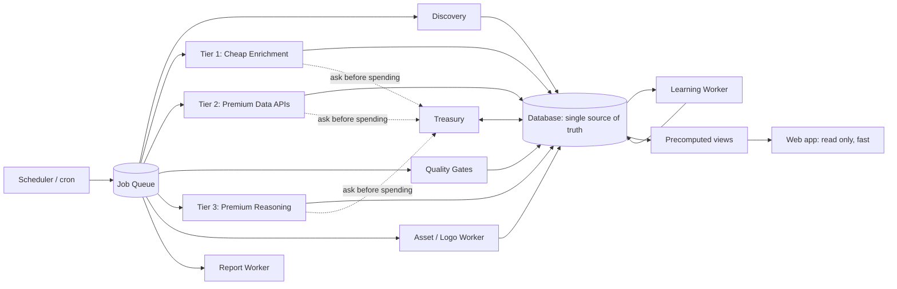
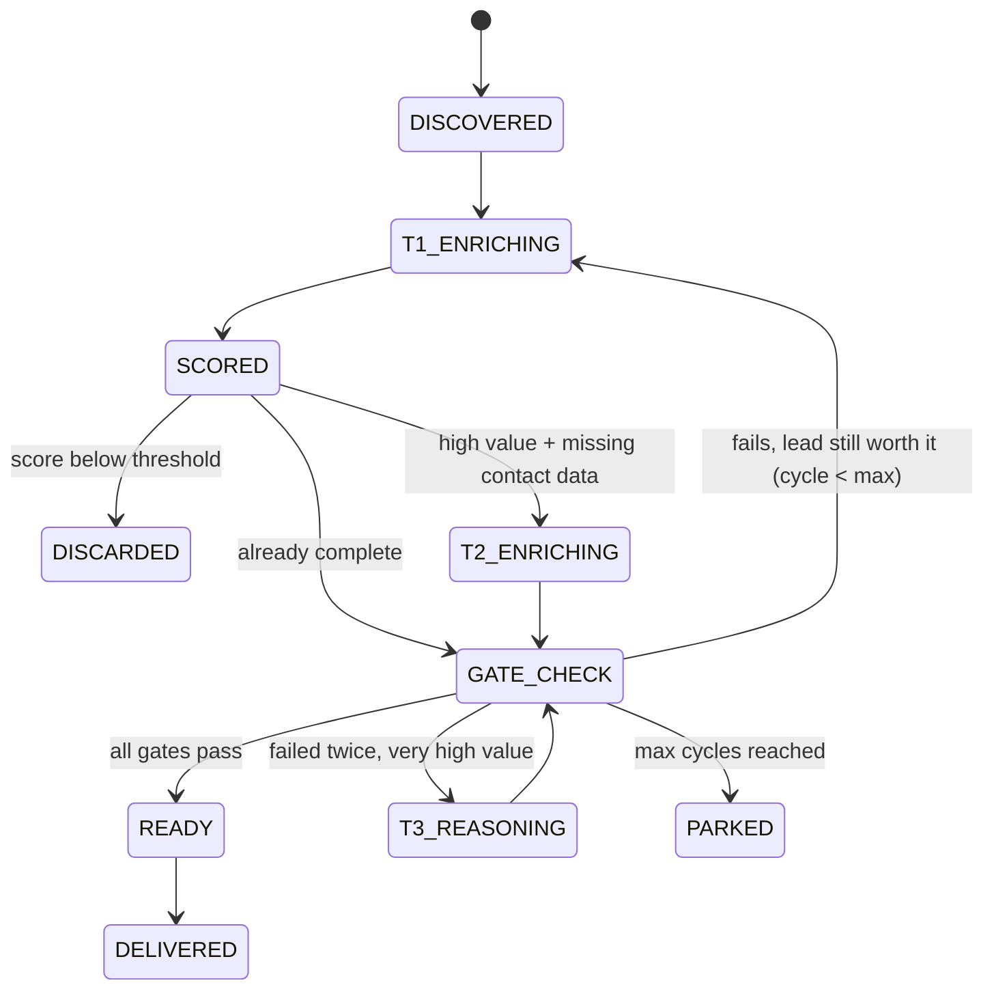

# Enrichment Engine — Master Plan

> **For the AI assistant reading this in the repo:** This is the founder's vision for the lead enrichment system, translated into engineering terms. Read the whole document before writing code. Do not build everything at once. Follow the phases in Section 12, inspect the existing codebase first (Phase 0), and adapt names and stack choices to what already exists. When this document and the existing code disagree, flag it and ask; don't silently pick one.

---

## 1. North Star (non-negotiable rules)

Every design decision must pass all six:

1. **Zero marginal human hours.** Client #1,000 costs the founder the same time as client #10: zero. Anything that requires a human per client is a bug.
2. **Smarter with every client.** Each new client adds data that improves results for all clients (shared learning, never shared private data).
3. **Cost-bounded by design.** No external call happens without (a) a cost estimate, (b) a budget check, and (c) a logged actual cost. Spend is always compared against subscription revenue.
4. **The app stays fast.** The web app only *reads* precomputed results. No scraping, no LLM calls, no enrichment in the user's request path. All heavy work runs in cloud workers.
5. **Runs without the founder's computer.** Everything is deployed in the cloud on schedules and queues.
6. **Readable by any engineer.** One folder per department, one responsibility per file, numbers in config files (not hardcoded), clear names. A new engineer should find "where do we change X" in under a minute.

Compliance note: prefer official APIs and licensed data providers over scraping platforms whose terms forbid it (LinkedIn and Instagram especially). Use separate providers for scale; do not rotate multiple keys on one provider to dodge its rate limits.

---

## 2. Translation Glossary (founder language → system language)

| Founder says | System term | What it actually is |
|---|---|---|
| Departments | **Worker services** | Independent cloud processes, each pulling jobs from its own queue |
| Cheap labor house | **Tier 1 Enrichment** | Free/cheap LLMs + web lookups. High volume, low cost |
| Big bosses / pros of enrichment | **Tier 2 Enrichment** | Paid data APIs (Apollo, Hunter, etc.). Used only for high-value leads |
| Expensive brains (Sonnet, GPT) | **Tier 3 Reasoning** | Premium LLMs for the hardest cases only. Strict cap |
| TSA agents / security doors | **Quality Gates** | Validation checks a lead must pass before a client sees it |
| Agents exchanging ideas | **Shared Findings Board** | A database table where every worker writes what it found; others read it. Workers don't chat with each other (that would be expensive and undebuggable) |
| "Spam what works harder" | **Strategy Learning** | Each enrichment strategy is scored by results-per-dollar; winners get more runs |
| Studying client dashboards | **Engagement Feedback Loop** | Client actions (opened, contacted, replied, won) feed back into lead scoring |
| Logo room | **Asset Worker** | Finds, cleans and stores company logos |
| Budget brain | **Treasury** | Tracks credits, spend, revenue, forecasts burn, enforces caps |
| Night shift / 8 a.m. report | **Scheduler + Report Worker** | Cron jobs that queue work overnight and build daily reports |
| Burner/free accounts | **Trial tier** | Quota-limited accounts that never touch paid budgets |

---

## 3. Architecture Overview



Core pieces:

- **Database** = single source of truth (Postgres recommended, or whatever the repo already uses).
- **Job queue** = how departments hand work to each other. A job is a small record: `{type, lead_id, client_id, payload, estimated_cost, attempt}`.
- **Workers** = separately deployed services. Each one: pull job → check budget → do work → write results → enqueue next job. They can scale independently (e.g. 20 Tier 1 workers, 2 Tier 2 workers).
- **Precomputed views** = what the web app reads. Lightweight, paginated, indexed.

---

## 4. The Lead Lifecycle (state machine)

Every lead has exactly one state. Workers only move leads between states. This is the backbone; build and test it first.



Rules:
- When a gate fails, it records **which fields are missing**, so the next enrichment pass targets only those fields (no re-doing work).
- `max_enrichment_cycles` (config, default 3) prevents infinite loops that burn money.
- `PARKED` leads are retried later only if a new strategy or provider becomes available.

---

## 5. Departments in Detail

Each department below lists: **Job · Inputs · Outputs · Cost class · Done when**.

### D0. Scheduler (the night shift)
- **Job:** Queues recurring work. Overnight: discovery + enrichment per active client according to plan budget. Daily: reports at 8:00 in each client's timezone. Hourly: treasury check.
- **Cost class:** Free.
- **Rule:** The scheduler only enqueues jobs; it never does the work itself.

### D1. Discovery
- **Job:** Find new candidate companies matching each client's ICP.
- **Inputs:** Client ICP (industry, location, size, signals).
- **Outputs:** New rows in `companies` (global, deduplicated by domain) + `client_leads` links.
- **Key scaling rule:** Companies are **global**. If 40 clients target the same company, it's discovered and enriched once and shared. This is the biggest cost saver at 1,000 clients.

### D2. Tier 1 — Cheap Enrichment ("cheap labor house")
- **Job:** Fill in as much as possible using free/cheap LLMs and public web data: website, description, socials, size signals, buying signals.
- **LLM Router:** One internal module (`llm_router`) chooses the provider per call based on availability, rate limits, and cost. Currently Gemini; add more providers as adapters (candidates to evaluate: Groq, OpenRouter free models, DeepSeek, Mistral, Together; verify current free tiers and terms before adding). If one provider is rate-limited, the router falls back to the next.
- **Shared Findings Board:** Every discovery is written to `enrichment_findings` as `{company_id, field, value, source, strategy_id, confidence, cost}`. Before working on a company, a worker reads existing findings so it builds on them instead of repeating them. This is how "agents exchange ideas."
- **Cost class:** ~free. Still logged.
- **Done when:** Lead is scored. High scorers with missing contact data are escalated to Tier 2.

### D3. Learning Worker ("becoming smarter")
Two loops:

1. **Strategy learning.** A *strategy* = a specific way of finding data (e.g. "search Google Maps for category X then read website", "check Instagram bio for email"). Each run records fields found, fields that later passed gates, and cost. Strategies are ranked by **verified fields per dollar, per ICP type**. Allocation: ~80% of runs go to top strategies, ~20% explore others (so new winners can be discovered). The split is in config.
2. **Engagement feedback.** Track what clients do with leads: viewed, contacted, replied, meeting, won, ignored. Leads/ICP traits that clients engage with get higher weight in scoring for that client, and anonymized patterns improve defaults for similar clients.

- **Privacy rule:** Cross-client learning uses aggregated patterns only. One client never sees another client's leads, messages or data.
- **Runs:** Nightly, after the enrichment shift.

### D4. Tier 2 — Premium Enrichment ("big bosses")
- **Job:** Find decision-maker contacts (name, role, email, phone) for high-value leads, via Apollo, Hunter, and future providers.
- **Entry criteria (config):** `lead_score >= tier2_threshold` AND contact fields missing AND client plan has Tier 2 budget left.
- **Global contact cache:** Never pay twice for the same domain/person. Check `contacts` first; cache results with a freshness date (e.g. re-verify after 90 days, configurable).
- **Must ask Treasury before every call.** If budget says no, the job waits or the lead is parked.

### D5. Quality Gates ("TSA")
- **Job:** Decide if a lead is good enough to show a client.
- **Order:** deterministic code checks first (free), cheap LLM only for ambiguous cases.
- **Default gates** (in `config/gates.yaml`, editable):
  - Company name verified (consistent across 2+ sources)
  - Website resolves and matches the company
  - Instagram exists and is active (and verified/strong following when relevant)
  - LinkedIn company page exists
  - Contact email present and deliverable (verification may cost credits, so it runs last)
- **Outputs:** `gate_results` row: pass/fail per gate + `missing_fields`.
- **Routing:** All pass → `READY`. Fail but lead is valuable (strong organic presence, or an under-represented ICP for that client) → back to Tier 1 with the missing fields list. Fail twice and very high value → Tier 3.

### D6. Tier 3 — Premium Reasoning
- **Job:** Hard cases only: ambiguous identities, conflicting data, complex research. Uses Claude Sonnet / GPT-class models.
- **Hard cap:** Daily and per-client limits in config. Never used for trial accounts.

### D7. Asset Worker ("logo room")
- **Job:** Make every company look premium in the app. Find the best logo (website favicon/meta images, social profile images, logo APIs), normalize it (remove background where possible, square crop, compress to WebP, consistent size), upload to a CDN/storage bucket.
- **Store only the URL** in the database. The web app never processes images.
- **Fallback:** Clean generated monogram (company initials + brand color) so nothing ever shows a broken image.

### D8. Treasury (the CFO)
The department that keeps the company alive. Responsibilities:
- **Ledger:** Every external call writes to `cost_ledger`: provider, client, lead, job type, credits used, money cost, timestamp.
- **Balances:** `provider_accounts` tracks remaining credits per provider.
- **Budget guard:** A single function every paid call goes through: `can_spend(client_id, provider, estimated_cost) -> yes/no`. Checks the client's plan budget, the global daily cap, and provider balance.
- **Forecast:** Daily, compute `burn_rate_last_7_days × 10` per provider versus remaining credits. If credits will run out within 10 days, alert the founder with "buy X credits of provider Y by date Z."
- **Unit economics:** Compare spend per client against that client's subscription revenue. Target: enrichment cost per client stays under a configured % of their monthly fee (e.g. `max_cost_ratio: 0.20`, founder to set). Flag clients above it.
- **Kill switch:** One config flag pauses all paid spending instantly.

### D9. Report Worker
- **Job:** Build each client's daily report (new READY leads, highlights, stats) at 8:00 in their timezone. Store it precomputed; the app just displays it.

---

## 6. Trial (free) Accounts

- On signup: generate **one** report using leads from the **shared global pool** that match their ICP (already enriched, near-zero cost). Trials never trigger Tier 2 or Tier 3.
- Next day on login: show today's report as locked (teaser: count of new leads, blurred previews) → "Subscribe to unlock today's report."
- Trial accounts have a hard daily cost cap of ~zero in config.
- **Open decision (later):** whether trials get a daily report. Keep it a config flag (`trial_daily_reports: false`) so it can be turned on without code changes.

---

## 7. Budget Allocation per Plan

Budgets live in `config/budgets.yaml`, never in code. Example shape (numbers are placeholders for the founder to set):

```yaml
plans:
  trial:    { tier1_daily_jobs: 50,   tier2_monthly_credits: 0,   tier3_monthly_calls: 0 }
  starter:  { tier1_daily_jobs: 500,  tier2_monthly_credits: 200, tier3_monthly_calls: 20 }
  pro:      { tier1_daily_jobs: 2000, tier2_monthly_credits: 800, tier3_monthly_calls: 100 }
global:
  max_cost_ratio: 0.20          # enrichment cost / subscription revenue
  forecast_window_days: 10
  daily_global_spend_cap_usd: 0 # founder sets
  kill_switch_paid_spend: false
```

---

## 8. Scaling to 1,000 Clients

- **Global dedupe:** companies and contacts are shared across clients; enrich once, use many times.
- **Queues, not loops:** workers pull jobs; scale by adding worker instances.
- **Idempotent jobs:** running a job twice must not double-charge or duplicate data (check before calling paid APIs).
- **Retries with backoff**, and a dead-letter queue for jobs that keep failing.
- **Per-provider rate limiters** in the provider adapters.
- **No heavy work in the web request path**, ever. The app reads indexed, paginated, precomputed views.
- **Observability:** an internal admin page showing queue depth, jobs/hour, spend today vs budget, gate pass rates, top strategies.

---

## 9. Data Model (core tables)

| Table | Purpose |
|---|---|
| `clients` | Accounts, plan, timezone, status (trial/active) |
| `icps` | Each client's ideal customer profile(s) |
| `companies` | **Global**, deduplicated by domain |
| `contacts` | **Global**, people at companies, with verification date |
| `client_leads` | Link client ↔ company: score, state, cycle count |
| `enrichment_findings` | Shared findings board (field, value, source, confidence, cost) |
| `strategies` / `strategy_runs` | Strategy definitions and their results per run |
| `gate_results` | Pass/fail per gate + missing fields |
| `jobs` | Queue records (if not using an external queue) |
| `cost_ledger` | Every cost event |
| `provider_accounts` | Credit balances per provider |
| `assets` | Logo URLs and metadata |
| `engagement_events` | Client actions on leads |
| `reports` | Precomputed daily reports |
| `templates` / `template_stats` | Outreach template library (Section 11) |

---

## 10. Repository Structure

Adapt to the existing stack; the principle is one folder per department and one adapter per external provider.

```
/apps
  /web                  # client-facing app: read-only, fast
  /admin                # internal ops dashboard
/workers
  /scheduler
  /discovery
  /enrich_tier1
  /enrich_tier2
  /gates
  /reasoning_tier3
  /assets_logos
  /learning
  /treasury
  /reports
/packages
  /providers            # one file per external API: gemini, groq, apollo, hunter...
  /llm_router           # picks provider, handles fallback + rate limits
  /budget               # can_spend(), cost logging
  /lead_state           # the state machine (single source of transition rules)
  /queue
  /db                   # schema + migrations
/config
  budgets.yaml
  gates.yaml
  thresholds.yaml       # scoring thresholds, max cycles, explore %
  providers.yaml
/docs
  ENRICHMENT_MASTER_PLAN.md
  /decisions            # short notes explaining major choices (ADRs)
```

**Hosting:** any cloud setup that supports scheduled jobs + always-on or queue-triggered workers + a managed database (e.g. Supabase/Postgres with workers on Railway, Render, Fly, or AWS). Choose based on what the repo already uses.

---

## 11. Outreach Template Library

### Core principle
A template is an **approach**, not a message. It defines structure, tone and angle. The final message is **always generated per recipient** from that lead's real data. The system never sends the same text to everyone.

### What a template contains
- `channel`: email | whatsapp | instagram_dm | linkedin
- `approach`: e.g. "compliment + specific observation + soft ask"
- `tone`: e.g. casual, formal, direct
- `structure`: ordered blocks (opener, personalized hook, value, call to action)
- `required_personalization_fields`: e.g. `company_name`, `recent_post_topic`, `contact_first_name`
- `example_output`: one generated example for preview (not sendable)

### Features
1. **My templates:** see and edit the templates I use, per channel.
2. **Community templates:** browse templates other users share, with performance stats: sends, reply rate, positive reply rate, meetings booked. Stats only appear after a minimum sample (e.g. 50 sends, configurable) so numbers are meaningful.
3. **Use this template:** clones the *approach* into my library. It is then personalized for my leads automatically.
4. **Personalization guard:** if a lead lacks the template's required personalization fields, the message is not generated as generic text. Instead, the lead is sent back for enrichment or the user picks another template.
5. **Privacy:** sharing is opt-in; shared templates are stripped of any client names, data or examples from that client's leads.
6. **Learning:** template performance feeds the Learning Worker, so the system can suggest the best approach per channel and ICP.

Compliance: respect each platform's messaging rules and anti-spam requirements (sending limits, opt-out in email, WhatsApp Business policies).

---

## 12. Build Phases

Build in order. Each phase must work end-to-end before the next.

| Phase | Build | Done when |
|---|---|---|
| **0. Audit** | Inspect current repo; map existing enrichment, DB, hosting. Write `docs/decisions/000-current-state.md` | Founder confirms the map |
| **1. Foundations** | Data model, lead state machine, job queue, provider adapter pattern, `cost_ledger`, `can_spend()`, config files | A test job moves a lead through states and logs cost |
| **2. Tier 1 + Gates** | LLM router (Gemini + 1 more provider), findings board, deterministic gates, scheduler for night shift | Leads reach READY automatically overnight, costs logged |
| **3. Tier 2 + Treasury** | Apollo/Hunter adapters, global contact cache, credit balances, 10-day forecast, alerts, kill switch | Paid calls are blocked when over budget; forecast alert works |
| **4. Learning** | Strategy scoring + 80/20 allocation, engagement events, feedback into scoring | Strategy rankings change based on real results |
| **5. Experience** | Logo worker, 8 a.m. reports, trial flow + paywall | New trial user gets one report; next day sees locked report |
| **6. Templates** | Template library, community stats, personalization guard | A shared template generates distinct personalized messages |
| **7. Scale & Ops** | Tier 3 reasoning with caps, admin dashboard, load testing with simulated 1,000 clients | Web app load times unchanged at simulated scale |

---

## 13. Coding Rules for the AI Assistant

1. Every external API call goes through `/packages/providers` and logs to `cost_ledger`. No exceptions.
2. Every paid call is preceded by `can_spend()`.
3. No LLM, scraping or enrichment calls inside web request handlers.
4. Numbers (thresholds, budgets, caps, percentages) live in `/config`, never hardcoded.
5. Lead state changes only through `/packages/lead_state`.
6. Jobs are idempotent and retry-safe.
7. One responsibility per file; descriptive names; short comments explaining *why*, not *what*.
8. Write tests for: state machine transitions, budget guard, gate logic, dedupe.
9. For any major decision, add a short note in `/docs/decisions`.
10. **Ask the founder before:** adding a new paid provider, changing budgets, changing gate rules, or anything that increases monthly cost.

---

## 14. Open Decisions for the Founder

- Monthly price per plan and target `max_cost_ratio`.
- Tier 2 score threshold (what makes a lead "worth paying for").
- Which extra free/cheap LLM providers to add first.
- Whether trials eventually get daily reports.
- Which gates are mandatory vs nice-to-have per ICP (e.g. Instagram matters for restaurants, LinkedIn for B2B).
- Hosting choice, if not already decided.
